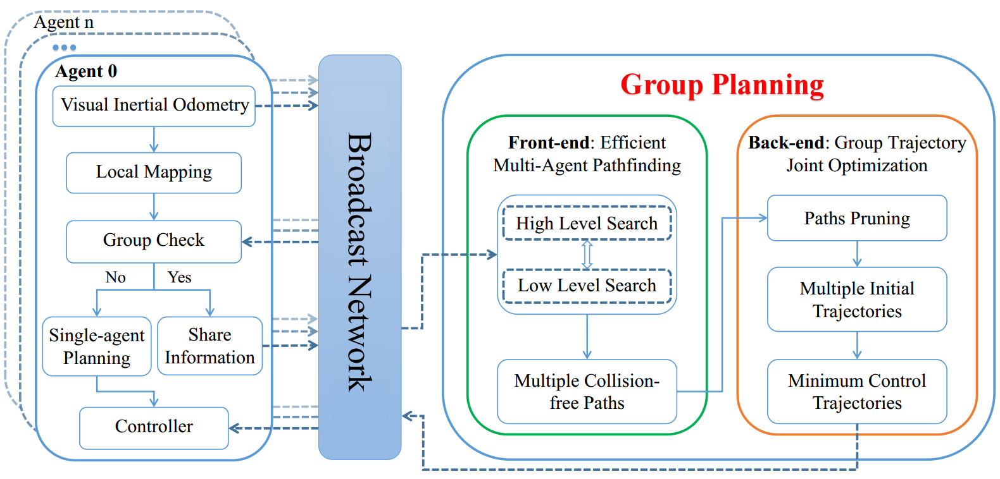
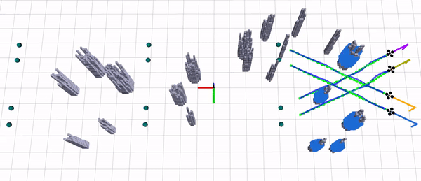
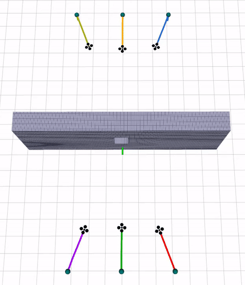
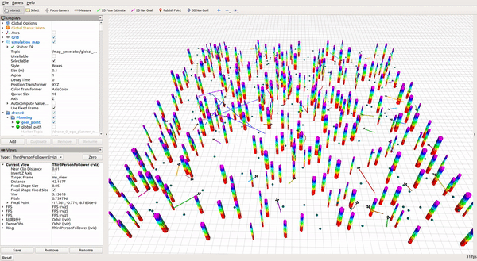

# EDG-TEAM

## 1. Overview
**EDG-TEAM** is an enhanced decentralized autonomous aerial robot team system with group planning.

**Paper**: **E**nhanced **D**ecentralized Autonomous Aerial Robot **Teams** with
**G**roup Planning

**Video**: 

**Architecture:**
<p align = "center">

</p>

---
## 2. Standard Compilation

**Requirements**: ubuntu 16.04, 18.04 with ros-desktop-full installation.

**Step 1**. Install [Armadillo](http://arma.sourceforge.net/), which is required by **uav_simulator**.
```
sudo apt-get install libarmadillo-dev
``` 

**Step 2**. Clone the code from github.
```
git clone https://github.com/ZJU-FAST-Lab/EDG-TEAM.git
```

**Step 3**. Compile,
```
cd EDG-TEAM
catkin_make
```

---
## 3. Experiment

### 3.1 real world - circle

We place eight drones on two concentric circles with diameters of 10m and 4m respectively (four drones on each circle). The mission of each drone is to go to the diagonal position of the other circle. In the mission, the entire system completes the mode switch in a manner of "Single-agent Planning to Group Planning to Single-agent Planning".

In a terminal at the _EDG-TEAM/_ folder, open the rviz for visualization and interactions
```
source devel/setup.bash
roslaunch edg_team rviz_map_circle.launch
```

In another terminal at the _EDG-TEAM/_, run the planner in simulation by
```
source devel/setup.bash
roslaunch edg_team real_world_circle.launch
```
Then you will see the scene in the gif.
<p align = "center">

</p>

### 3.2 real world - rectangle
The four drones cross and exchange positions every 8m in the longitudinal direction in a dense environment. The entire mission has 5 crossflights, and each cross-flight performs the mode switch in a manner of "Single-agent Planning to Group Planning to Single-agent Planning". When four drones are dispersed, each drone performs single-agent planning. When four drones assemble, group planning is triggered.

In a terminal at the _EDG-TEAM/_ folder, open the rviz for visualization and interactions
```
source devel/setup.bash
roslaunch edg_team rviz_map_rect.launch
```

In another terminal at the _EDG-TEAM/_, run the planner in simulation by
```
source devel/setup.bash
roslaunch edg_team real_world_rect.launch 
```

Then you will see the scene in the gif.
<p align = "center">

</p>

### 3.3 narrow gate challenge
We create an extremely challenging environment, consisting of a wall with a narrow gate. Each side of the wall has three drones, and their goal points are diagonal positions on the other side.

In a terminal at the _EDG-TEAM/_ folder, open the rviz for visualization and interactions
```
source devel/setup.bash
roslaunch edg_team rviz_map_narrow_gate.launch
```

In another terminal at the _EDG-TEAM/_, run the planner in simulation by
```
source devel/setup.bash
roslaunch edg_team narrow_gate_challenge.launch
```

Then you will see the scene in the gif.
<p align = "center">

</p>

### 3.4 large scale simulation
In a 50×50m map, we simulate future air traffic scenarios. The initial positions of 50 drones are generated at random, and each drone must pass through three randomly generated goal positions. When multiple drones meet the group planning criteria, group planning is triggered. Group planning is triggered 35 times during the whole mission.

**Note:** This experiment requires a lot of computing power. You can comment out lines 135-136 in grid_map.cpp(EDG-TEAM/src/planner/plan_env/src/grid_map.cpp) to save computing power. However, there is still the possibility that the program crashes due to insufficient computing power.

In a terminal at the _EDG-TEAM/_ folder, open the rviz for visualization and interactions
```
source devel/setup.bash
roslaunch edg_team rviz_map_large_scale_simulation.launch 
```

In another terminal at the _EDG-TEAM/_, run the planner in simulation by
```
source devel/setup.bash
roslaunch edg_team large_scale_simulation.launch 
```

Then you will see the scene in the gif.
<p align = "center">

</p>

## 4. Utilize the Full Performance of CPU
The computation time of our planner is too short for the OS to increase CPU frequency, which makes the computation time tend to be longer and unstable.

Therefore, we recommend you to manually set the CPU frequency to the maximum.
Firstly, install a tool by
```
sudo apt install cpufrequtils
```
Then you can set the CPU frequency to the maximum allowed by
```
sudo cpufreq-set -g performance
```
More information can be found in [http://www.thinkwiki.org/wiki/How_to_use_cpufrequtils](http://www.thinkwiki.org/wiki/How_to_use_cpufrequtils).

Note that CPU frequency may still decrease due to high temperature in high load.

## 5. Acknowledgements

